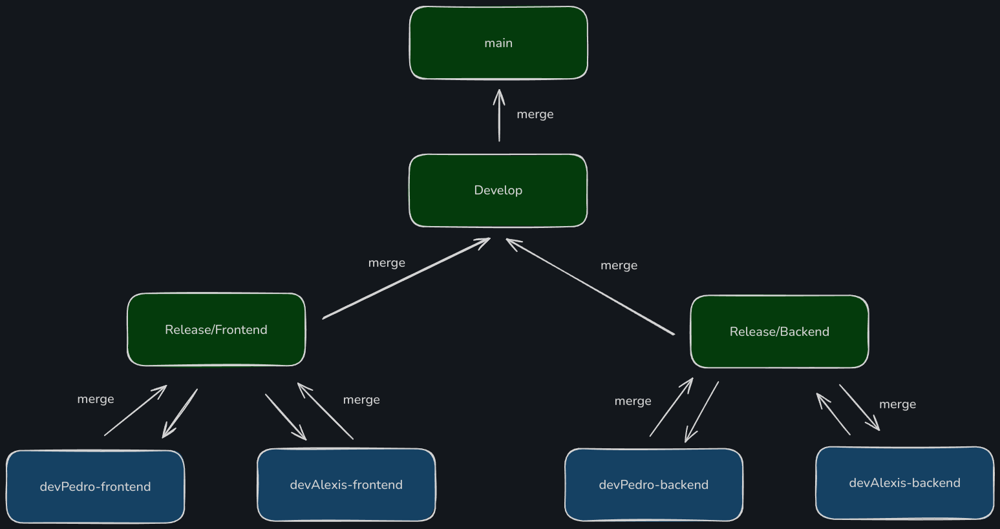

# Gestion de negocio

[Documentación Tailwindcss para Angular](https://tailwindcss.com/docs/guides/angular)

[Documentación Flowbite para Angular](https://flowbite.com/docs/getting-started/angular/)

[Componentes Flowbite](https://flowbite.com/docs/getting-started/introduction/)

## Ramas

### main
Esta es la rama principal del proyecto. Contiene el código más estable y probado, listo para ser desplegado en producción. Los cambios en esta rama se se dan desde la fusion de la rama `Develop`.

### Develop
Esta rama es una combinación de las ramas `Release/Backend` y `Release/Frontend`. Es donde se integran y prueban todas las nuevas características del backend y frontend antes de ser promovidas a la rama `main`. Aquí es donde se lleva a cabo la mayor parte del desarrollo y las pruebas iniciales.

### Release/Backend
Esta rama se dedica exclusivamente al backend del proyecto. Contiene las características y correcciones específicas del backend que están listas para ser lanzadas. Una vez que el backend está completamente probado y preparado, los cambios se fusionan en `Develop`.

### Release/Frontend
Esta rama se enfoca exclusivamente en el frontend del proyecto. Contiene todas las características y correcciones del frontend que están listas para ser lanzadas. Los cambios en esta rama se fusionan en `Develop` una vez que están completamente probados.

